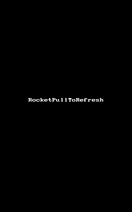

# Rocket Pull-to-refresh

Android Pull-to-refresh widget with rocket launching header!

### Feature

* Bezier curve while pulling down, with movement by touch position
* Rocket launching and elastic animation while loading

### Todo

* [ ] pull resistor config
* [ ] pull distance limitaion config
* [ ] pull down/up enable/disable config
* [ ] bounce back duration config
* [ ] custom interpolator config
* [ ] horizontal refresh and load

### Bugs

* [ ] multi-touch pull
* [ ] rocket header height should not be fixed

### License

Apache 2.0
